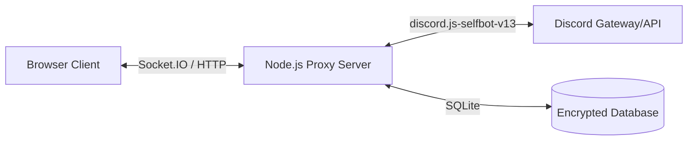

# Cordverse

A self-hosted, lightweight Discord client MVP designed for privacy and multiple account management. It acts as a proxy between your browser and Discord, keeping your tokens secure on your own server.


## Features


### Core Functionality
- **Self-Hosted Proxy**: Your backend acts as the intermediary, handling Discord WebSocket connections and API requests.
- **Multi-Account Switching**: Seamlessly toggle between multiple Discord accounts without re-entering credentials.
- **Real-time Messaging**: Instant message updates using `socket.io`.
- **Rich Content Support**: Renders images, attachments, and embeds (Open Graph, etc.).

### Security & Privacy
- **Token Encryption**: Discord tokens are encrypted using AES-256 before being stored in the local SQLite database. They are never stored in plain text.
- **Token Vault**: Securely manage multiple identities.
- **Local Data**: All account data is stored locally on your machine/server.

## Architecture



## Getting Started

### Prerequisites
- Node.js (v18+)
- npm

### Installation

1. **Clone the repository**
   ```bash
   git clone <repository-url>
   cd cordverse
   ```

2. **Backend Setup**
   ```bash
   cd backend
   npm install
   # An ENCRYPTION_KEY will be automatically generated in .env upon first setup/run if configured, 
   # or you can manually add one to .env
   ```

3. **Frontend Setup**
   ```bash
   cd frontend
   npm install
   ```

### Running the Application

You can start both services independently:

**Backend (Port 3001)**
```bash
cd backend
npm start
```

**Frontend (Port 5173)**
```bash
cd frontend
npm run dev
```

Visit `http://localhost:5173` to start.

## Usage

1. **Login**: Enter your Discord token on the login screen.
2. **Switch Accounts**: Once logged in, click your avatar at the bottom of the sidebar to switch accounts or add a new one.
3. **Chat**: Navigate servers and channels to view history and send messages.

## ⚠️ Disclaimer

This application utilizes `discord.js-selfbot-v13` to automate user accounts. **Automating user accounts ("self-botting") is a violation of Discord's Terms of Service.** This project is for educational purposes and personal experimentation only. The developers are not responsible for any account bans or restrictions resulting from the use of this software. Use at your own risk.
